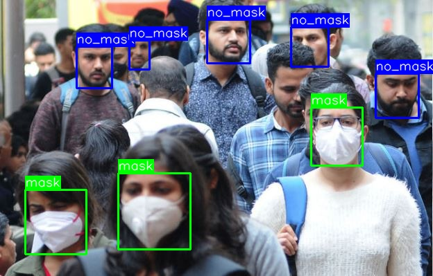
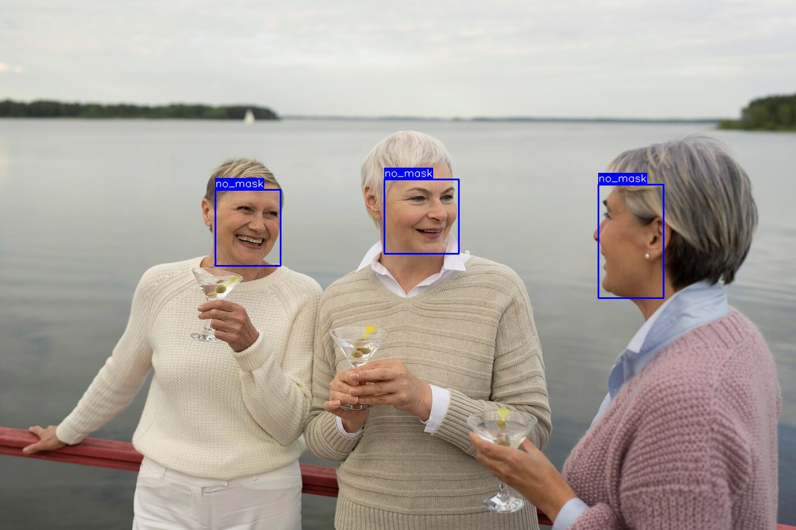
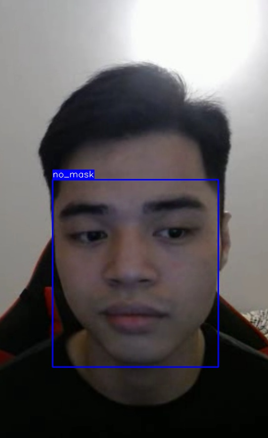

# [PYTORCH] YOLO (You Only Look Once)
## Introduction
Here my pytorch implementation of the model described in the paper yolov5: [paper](https://arxiv.org/pdf/2104.13634.pdf)

<p align="center">
  
</p>
<p align="center">
  
</p>

<p align="center">
Examples of my model's output.
</p>

## Requirements: 
- **python 3.9**
- **torch 2.0**
- **opencv (cv2)**
- **Argparse 1.4**
- **ultralytics**
## Dataset:
Link to dataset that I have trained [here](https://www.kaggle.com/datasets/andrewmvd/face-mask-detection/data)!

## How to run my code:
```c
python deploy.py --webcam 0             # webcam
                 --image  image.jpg     # image
                 --video  vid.mp4       # video
```
## Results: 
Some output predictions for experiments are shown below:





